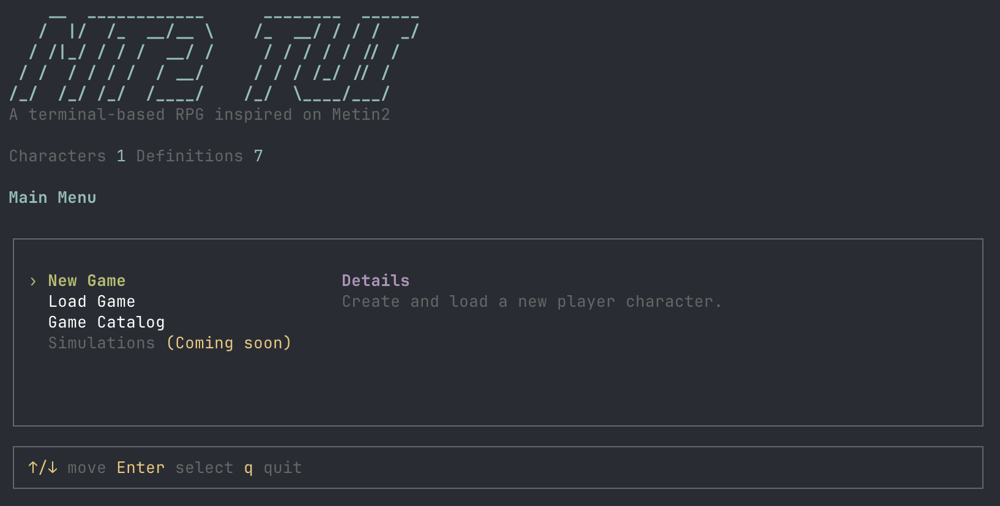

# mt2-tui

A terminal-based game inspired on the MMORPG Metin 2.

## Getting started

```bash
cd core
npm install
npm run dev
```

## Usage

### Create an item definition

Item definitions live under `core/content/definitions/items/`. Weapons currently
use `core/content/definitions/items/weapons/`.

Create a JSON file named after the item definition, including its upgrade level:

```text
core/content/definitions/items/weapons/sirius-sword+0.json
```

Set `defId` to the definition path without `core/content/definitions/` and
without `.json`:

```json
{
	"defId": "items/weapons/sirius-sword+0",
	"name": "Sírius Sword",
	"description": "",
	"type": "weapon",
	"subType": "sword",
	"wearableClasses": [
		"warrior",
		"ninja",
		"sura"
	],
	"wearableFromLevel": 80,
	"baseStats": {
		"physicalDamage": 237,
		"magicDamage": 155,
		"damageSpread": 40,
		"attackSpeed": 15,
		"strongAgainst": {
			"demons": 2,
			"half-humans": 2
		}
	}
}
```

The upgrade level is inferred from the `+N` suffix in the `defId`. For example,
`items/weapons/sirius-sword+0` is treated as upgrade level `0`.

Restart the TUI after adding or editing definitions so the file repository reads
the latest JSON files.

### Create an ANSI item icon from a PNG

Place item assets under `core/content/assets/items/`. For example, keep the
source PNG and generated ANSI icon next to each other:

```text
core/content/assets/items/sirius-sword.png
core/content/assets/items/sirius-sword.ansi
```

Standard sizes:
sm - 16x16 for swords, 16x8 for daggers, 16x24 for two-handed swords
md - 24x24
lg - 32x32

Characters though use unique sizes:

classes: sm (width: 16), md (width: 24)
monsters: sm (width: 32)

Run the converter from the `core` package:

```bash
cd core
npm run sprite:ansi -- ./content/assets/items/sirius-sword.png --width 24
```

Write the generated ANSI sprite to a file:

```bash
npm run sprite:ansi -- ./content/assets/items/sirius-sword.png --width 24 --out ./content/assets/items/sirius-sword.ansi
```

Use `--width` and `--height` to tune the terminal-cell size. Use
`--alpha-threshold` if faint transparent pixels create speckles around the icon:

```bash
npm run sprite:ansi -- ./content/assets/items/sirius-sword.png --width 24 --alpha-threshold 32
```

The converter prints truecolor ANSI half-block art. This is useful for testing
item icons in the terminal before adding them to the TUI rendering flow. See the
full converter guide for details.

## Documentation

- [PNG to ANSI sprite converter](core/docs/00-png-to-ansi-sprite-converter.md)

## References

https://en-wiki.metin2.gameforge.com/index.php/Ninja/armour

## License

MIT
